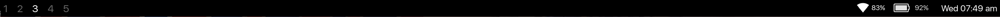

# i3-status

Highly customizable and extendable bar for the [i3 window manager](http://i3wm.org/). 

This is a fork of amazing [fehmer's node i3-status](https://github.com/fehmer/i3-status)
I have added a few minor visual tweaks possibility to set the dividers as well as divider gaps and option for pongo rendering.

I have also made slight update to the Date builtin block.

checkout the two custom blocks: 
[battery](https://github.com/tomasbulva/i3-status-battery)
[wifi](https://github.com/tomasbulva/i3-status-net) 

